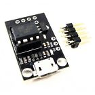
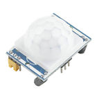
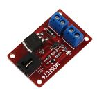
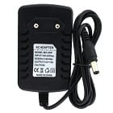
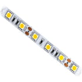
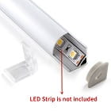
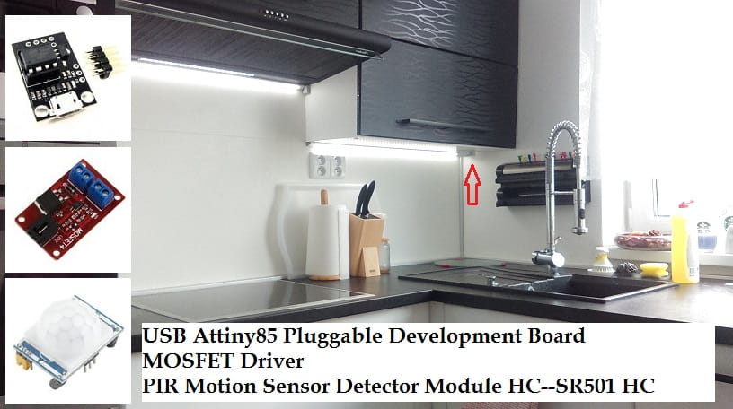
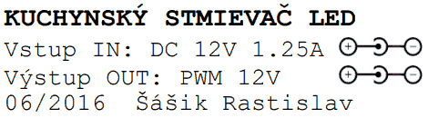

# ARDUINO - Kuchynský LED stmievač (Kitchen LED Dimmer)
## Princíp fungovania
<p>Mikrokontrolér (ATTiny85) vyhodnocuje údaje z PIR senzora (HC-SR501). Ak zistí prítomnosť signálu z PIR senzora, tak počas dvoch sekúnd postupne cez MOSFET driver rozsvieti LED pásik z 0% na 100% jasu. Využíva pritom PWM signál. Sleduje, či je stále pohyb v miestnosti. Ak áno, drží LED pásik stále rozsvietený. Toto je zároveň nastavené tak, že svetlo svieti približne minútu aj po poslednom signáli pohybu z PIR senzora. Je to tak nastavené preto, aby zbytočne osvetlenie neblikalo a človek mal v miestnosti čas aktivovať PIR senzor aj pri malom alebo krátkom pohybe.</p>

<p>Ak je vyhodnotené, že už nie je v miestnosti pohyb, tak LED pásik postupne zhasína do úrovne 30% jasu. Je udržiavané šero alebo prítmie v miestnosti po dobu jednej minúty pre prípad, že by sa človek vrátil späť do miestnosti. Takto vlastne nevstupuje napr. v noci do úplnej tmy.</p> 

```
PERIOD DIMMER

   100% (ON)       ______________
                  /              \ 
   30% (dusk)    /                \_______________ 
   0% (OFF)   __/                                 \____

```

<p>Ak je zaznamenaný pohyb aj počas tejto minúty prítmia, tak led pásik sa opäť plynule rozsvieti na 100% jasu. Ak žiadny pohyb nenastal, tak led pásik plynule zhasne. </p>

## Zapojenie

```
ATMEL ATTINY85

                +-\/-+
    (D 5) PB5  1|    |8  Vcc
    (D 3) PB3  2|    |7  PB2 (D 2)
    (D 4) PB4  3|    |6  PB1 (D 1) LED (MOSFET DRIVER)
          GND  4|    |5  PB0 (D 0) PIR (HC-SR501)
                +----+
```

## Software do mikrokontroléra
<p>Priložený súbor <strong>kitchen_dimmer.ino</strong> skompilovať v <a href="https://www.arduino.cc/en/software#download" target="_blank">Arduino IDE </a>alebo vo <a href="https://code.visualstudio.com/download" target="_blank">Visual Studio Code </a>s <a href="https://marketplace.visualstudio.com/items?itemName=vsciot-vscode.vscode-arduino" target="_blank">rozšírením o Arduino</a>.</p> <p>Prípadne je tu možnosť si upraviť podľa potreby jednotlivé časy periód  alebo aj upraviť PINy k pripojeniu PIR senzoru alebo MOSFET driveru.</p>

## Použitý materiál
- __Attiny85__ Pluggable Development Board - má integrovaný stabilizátor z 12V na 5V, zároveň mi napája aj PIR 5V
<figure>
    <a href="https://s.click.aliexpress.com/e/_Dk5FulF" 
    target="_blank">
        
    </a>    
</figure>

- __PIR Motion Sensor__ Detector Module HC-SR501
<figure>
    <a href="https://s.click.aliexpress.com/e/_DmvFKW5"
    target="_blank">    
        
    </a>    
</figure>

- __MOSFET Driver__
<figure>
    <a href="https://s.click.aliexpress.com/e/_DFBZ7Yd"
    target="_blank">     
        
    </a>    
</figure>

- __12V Power Supply__
<figure>
    <a href="https://s.click.aliexpress.com/e/_Dluam65"
    target="_blank">     
    
    </a>    
</figure>

- __LED 5050 Strip__
<figure>
    <a href="https://s.click.aliexpress.com/e/_DF7QNHP"
    target="_blank">     
    
    </a>    
</figure>

- __Aluminum Profile__ for LED 5050 strip
<figure>
    <a href="https://s.click.aliexpress.com/e/_DlPlVol"
    target="_blank">     
    
    </a>    
</figure>

- __Krabička__ a nejaké tie káble ponachádzané doma

## Po skompletovaní
<figure>
    <p>Zmontované v bielej krabičke (nad červenou šípkou):</p>    
    
    <p>Štítok na krabičku:</p>
       
</figure>

## Zdroj informácií
K vytvoreniu tohoto stmievača ma inšpiroval tento článok:
https://www.arduinoslovakia.eu/blog/2016/10/led-osvetlenie-do-kuchyne

## Záver
Funguje mi bez problémov od roku 2016 a som nadmieru spokojný. 